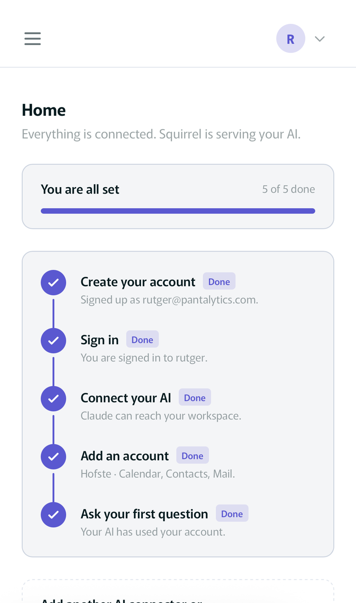
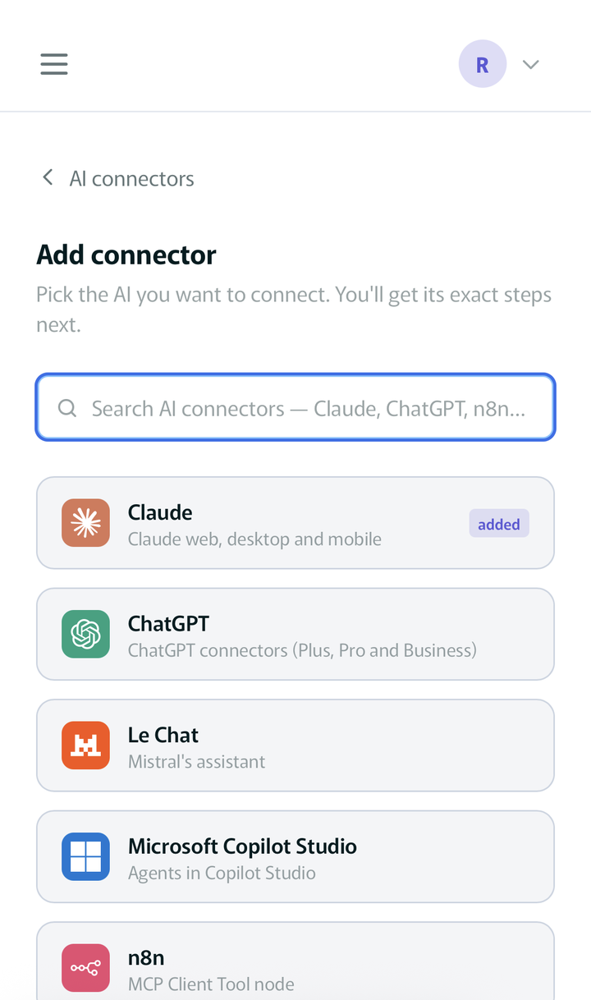
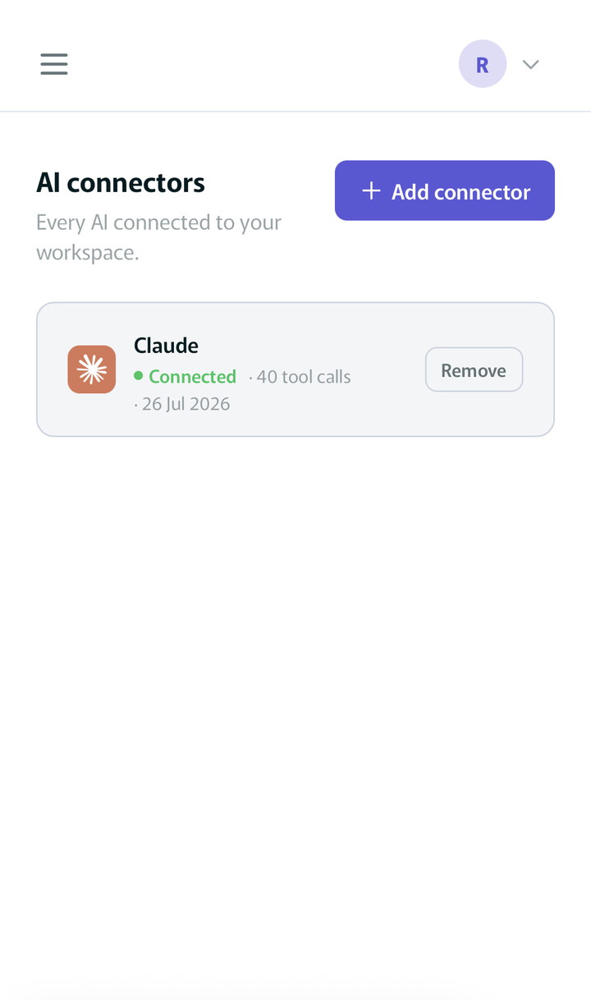
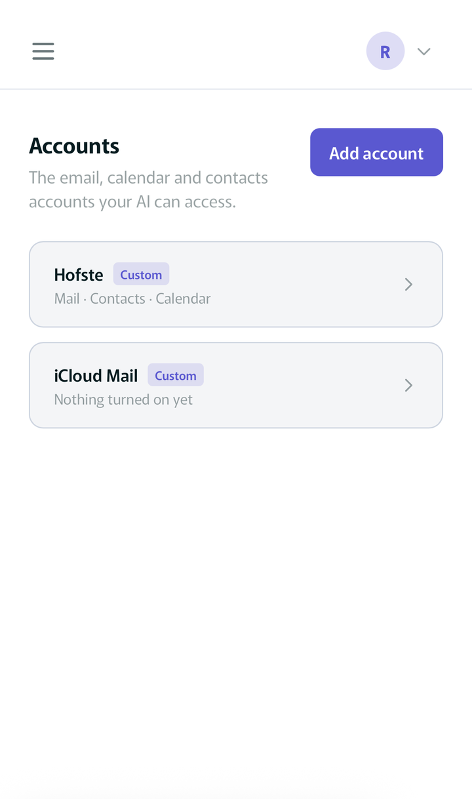
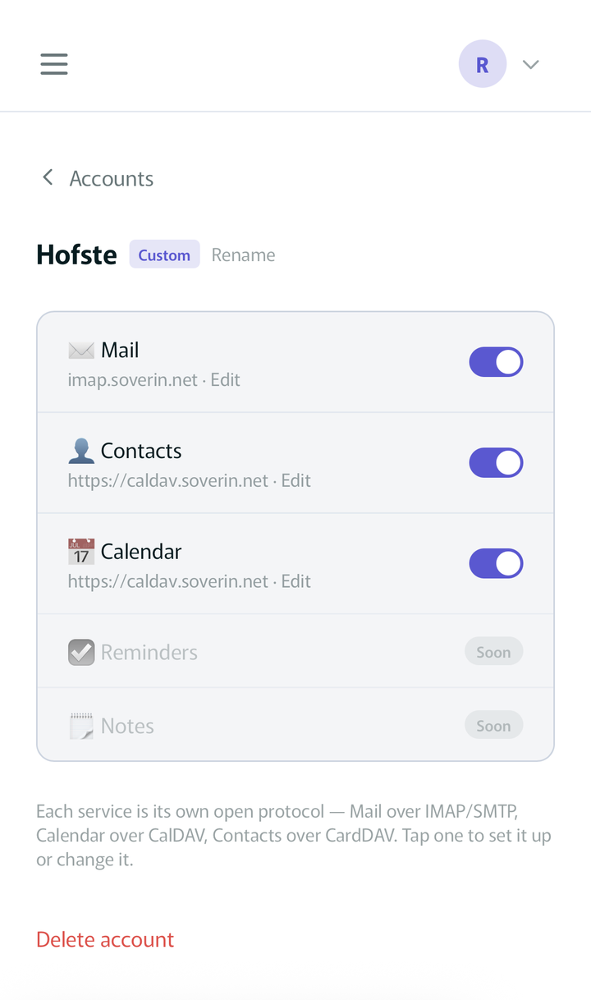
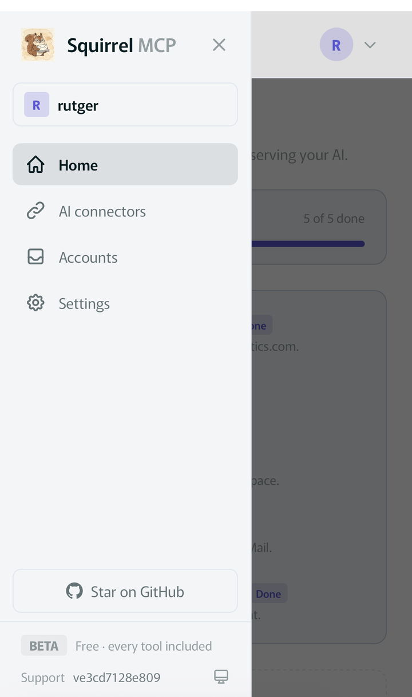

# 🐿️ Squirrel

--- 

### **Update** if you just want to get up and running in seconds, consider using the hosted version:
### [Squirrel Pro](https://www.pantalytics.com/apps/squirrel)

---

**Own your data.** Squirrel is a local, sovereign personal-information hub that
exposes *your* mailbox to Claude and other MCP clients — running entirely on your
machine, talking straight to your mail provider over TLS. No mail content ever
leaves for a third party.

Squirrel is the face; the providers underneath are **swappable backends**.
It speaks plain **IMAP/SMTP** for mail, **CardDAV** for contacts and **CalDAV**
for calendar — the three pillars, each behind its own provider protocol so
Gmail/Outlook can plug in later without a rewrite. Point it at any mailbox by
filling in your provider's host names; there are no built-in presets. A tool
family (`mail_*`, `contacts_*`, `calendar_*`) is present only when that pillar
is configured.

---

## What you can do (v1: mail)

- *"Which unread mails came in this week from my accountant?"*
- *"Read message 4213 in INBOX and summarise the thread."*
- *"Draft a reply to Anna — I'll review before it goes out."*
- *"File these three newsletters into the Archive folder."*
- *"Flag everything from the tax office so I can deal with it tonight."*

| Tool | What it does | Safe? |
|------|--------------|-------|
| `mail_list_folders` | List mailboxes/folders | read-only |
| `mail_search` | Search a folder, paginated; filter unread / flagged | read-only |
| `mail_read` | Read one message (large bodies are truncated) | read-only |
| `mail_read_chunk` | Fetch the next slice of a large body | read-only |
| `mail_get_attachment` | Download one attachment | read-only |
| `mail_draft` / `mail_edit_draft` | Create / update a draft in Drafts, attachments included | writes to Drafts |
| `mail_send` | Send a message, attachments included — **requires `confirm=true`** | ⚠️ outgoing |
| `mail_move` | Move messages between folders — **requires `confirm=true`** | ⚠️ mutating |
| `mail_flag` | Flag / unflag messages — the star, `flagged=false` clears it | reversible |

Flagging and finding are two halves of one thing: `mail_flag` sets the marker,
`mail_search(flagged_only=true)` gets those messages back — filtered by the
server, not by paging a folder.

**Attachments** go both ways. `mail_read` lists them and `mail_get_attachment`
downloads one; sending takes an `attachments` list on `mail_send`, `mail_draft`
and `mail_edit_draft`. Each entry either points at a file already in the mailbox
— `{"source_uid": "412", "source_index": 0}`, which is how forwarding works and
never copies the bytes through the AI client — or carries its own
`{"filename": ..., "content_base64": ...}`. Editing a draft keeps the files it
already has unless you say otherwise.

**Replies land in the thread.** `mail_send` and `mail_draft` take a
`reply_to_uid` (the message being answered, plus the `reply_to_folder` it lives
in), and the reply goes out carrying the `In-Reply-To` and `References` headers
every mail client uses to build a conversation. A subject beginning with "Re:"
is not the same thing — Gmail will often guess it back into the thread, Outlook
generally will not, and you end up with a second conversation. With
`reply_to_uid` the recipient and subject may be left out entirely (taken from
the original, `Reply-To` respected), and `reply_all=true` keeps the other
participants on cc.

Guardrails: sending and moving are flagged `destructiveHint` and refuse to run
without an explicit `confirm=true`, so Claude checks with you first. Flagging is
the deliberate exception — it alters no message and the same tool takes it back
off — so it runs without one. Big mailboxes
are handled with pagination (`mail_search`) and chunking (`mail_read_chunk`) —
never an all-in-one dump.

### Contacts (CardDAV) & Calendar (CalDAV)

`contacts_*`: `contacts_list_addressbooks` · `contacts_search` (paginated) ·
`contacts_read` · `contacts_create` / `contacts_update` / `contacts_delete`.

`calendar_*`: `calendar_list_calendars` · `calendar_search_events` (ISO date
window) · `calendar_read_event` · `calendar_create_event` / `calendar_update_event`
/ `calendar_delete_event`.

All writes require `confirm=true`. Both pillars reuse the same account credentials
as mail (most providers let one password cover IMAP/SMTP, CardDAV and CalDAV) and
lean on the mature `caldav` + `icalendar` + `vobject` libraries.

## Or skip the install: Squirrel in your browser

Everything below runs on your own machine. If you'd rather not host anything,
[squirrel.pantalytics.com](https://squirrel.pantalytics.com) is the hosted
version of this package: create an account, connect your AI client, add a
mailbox — same three pillars, same open protocols, free while in beta.

<table>
  <tr>
    <td align="center"><br><sub>Home walks you from sign-up to your first question.</sub></td>
    <td align="center"><br><sub>Pick the AI you want to connect — Claude, ChatGPT, Le Chat, n8n, …</sub></td>
    <td align="center"><br><sub>The connector turns green on its first call, with live usage.</sub></td>
  </tr>
  <tr>
    <td align="center"><br><sub>Accounts: the email, calendar and contacts accounts your AI can access.</sub></td>
    <td align="center"><br><sub>Each service is its own open protocol — flip Mail, Contacts and Calendar on per account.</sub></td>
    <td align="center"><br><sub>Free while in beta, every tool included.</sub></td>
  </tr>
</table>

## Install

```bash
git clone https://github.com/pantalytics/squirrel-mcp.git
cd squirrel-mcp
uv venv --python 3.10 && source .venv/bin/activate
uv pip install -e .
```

## Configure

```bash
cp .env.example .env
```

Fill in `.env` with your mailbox login and your provider's IMAP/SMTP hosts — look
those up in your provider's own docs; Squirrel never guesses them. The ports
default to implicit TLS (993 / 465), so usually the hosts are all you add:

```
SQUIRREL_MAIL_EMAIL=you@yourdomain.eu
SQUIRREL_MAIL_PASSWORD=your-account-password
SQUIRREL_IMAP_HOST=imap.yourprovider.eu
SQUIRREL_SMTP_HOST=smtp.yourprovider.eu
```

Optional: `SQUIRREL_CARDDAV_URL` / `SQUIRREL_CALDAV_URL` switch on the contacts
and calendar pillars, and `SQUIRREL_MAIL_USERNAME` covers the rare provider whose
login isn't the email address.

`.env` is gitignored and never leaves your machine.

Test it before wiring up Claude:

```bash
python -m squirrel_mcp --check
```

## Run

```bash
# stdio (for Claude Desktop / Claude Code)
python -m squirrel_mcp

# streamable-http (for one trusted network; put auth in front of it)
python -m squirrel_mcp --transport streamable-http --host 0.0.0.0 --port 8000
```

## Register in Claude

**Claude Code:**

```bash
claude mcp add squirrel -- python -m squirrel_mcp
```

**Claude Desktop** — add to `claude_desktop_config.json`:

```json
{
  "mcpServers": {
    "squirrel": {
      "command": "python",
      "args": ["-m", "squirrel_mcp"],
      "env": {
        "SQUIRREL_MAIL_EMAIL": "you@yourdomain.eu",
        "SQUIRREL_MAIL_PASSWORD": "your-account-password",
        "SQUIRREL_IMAP_HOST": "imap.yourprovider.eu",
        "SQUIRREL_SMTP_HOST": "smtp.yourprovider.eu"
      }
    }
  }
}
```

## End-to-end check

With `.env` filled in, verify the live connection without touching Claude:

```bash
python scripts/e2e_soverin.py
```

It logs in, lists your folders, shows the newest few INBOX subjects, and reads
the latest message — read-only, nothing is sent or moved.

## Run in Docker

```bash
cp .env.example .env      # fill in your credentials
docker compose up --build # MCP endpoint at http://localhost:8000/mcp
```

## Testing

Four layers, all runnable with `make` (see `make help`):

| Layer | Command | What it does | Needs |
|-------|---------|--------------|-------|
| Unit | `make test` | Mocked handler/config/tool tests | nothing |
| Integration (real e2e) | `make test-int` | Spins up **GreenMail** (a real IMAP/SMTP server) in Docker and exercises the actual provider: folders, search, read, attachment, draft, move, send | Docker |
| Docker smoke | `make docker-smoke` | Builds the image, runs Squirrel-in-a-container wired to GreenMail, and drives a full MCP handshake + tool call over http | Docker |
| Browser (Playwright) | `make playwright` | A browser client (`web/console.html`) connects to the containerised server, lists tools, and reads folders — proving the whole stack through a real browser | Docker + Node |

`make test-all` runs everything and tears the stack down. No secrets are needed —
the e2e layers use a local GreenMail server, not your real mailbox. CI
(`.github/workflows/ci.yml`) runs all four on every push.

```bash
make install                     # venv + dev deps
make lint                        # ruff + ty
make test                        # fast unit tests
make test-all                    # unit + integration + docker + playwright
```

The end-to-end tests point Squirrel at GreenMail over plaintext via the transport
knobs `SQUIRREL_IMAP_SECURITY` / `SQUIRREL_SMTP_SECURITY` (`ssl` | `starttls` |
`plain`) and `SQUIRREL_TLS_VERIFY`. Against a real provider these stay at their
secure defaults (`ssl`, verify on).

## Architecture, in one breath

Tools talk only to the `MailProvider` protocol (`providers/protocol.py`); the
`SoverinMailProvider` (`providers/soverin/`) is the sole place that knows IMAP/SMTP,
and it leans on `imap-tools` + stdlib. Swapping to Gmail/Outlook later means adding
a provider that satisfies the same protocol — the tools don't change. Blocking
network calls run off the event loop via `run_blocking`. See `CLAUDE.md` for the
full map and the open-core seams the private admin package extends.

---

© Pantalytics B.V. Licensed under the Elastic License 2.0.
